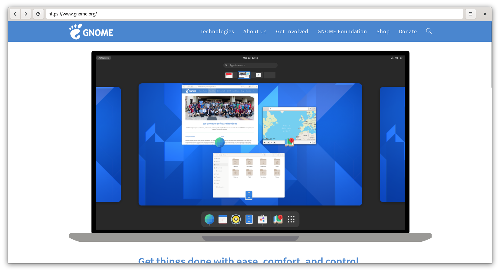

<h1 align="center">Browser</h1>


<h2 align="center" >
    A GTK browser trying to follow the GNOME Human Interface Guidelines. <br>
    
    

</h2>
<h1 align="center">


</h1>

## ⚈ Building from source

### GNOME Builder
GNOME Builder is the environment used for developing this application. 
It can use Flatpak manifests to create a consistent building and running 
environment cross-distro. Thus, it is highly recommended you use it.

1. Download [GNOME Builder](https://flathub.org/apps/details/org.gnome.Builder).
2. In Builder, click the "Clone Repository" button at the bottom, using `https://github.com/CleoMenezes/browser` as the URL.
3. Click the build button at the top once the project is loaded.

### Meson
```
git clone https://github.com/CleoMenezes/browser
cd browser
meson builddir --prefix=/usr/local
ninja -C builddir install
```


# ⚈ Tech Stack

The following tools were used in the construction of the project:

- [Python](https://www.python.org/)
- [GTK](https://www.gtk.org/)


## License

GPL

---

> LinkedIn [Cleo-menezes-jr](https://www.linkedin.com/in/cleo-menezes-jr/) &nbsp;&middot;&nbsp;
> GitHub [CleoMenezes](https://github.com/CleoMenezes) &nbsp;&middot;&nbsp;
> Twitter [@Menemezis](https://twitter.com/Menemezis) &nbsp;&middot;&nbsp;
> Instagram [@cleo.menemezes](https://www.instagram.com/cleo.menemezes/) &nbsp;&middot;&nbsp;
